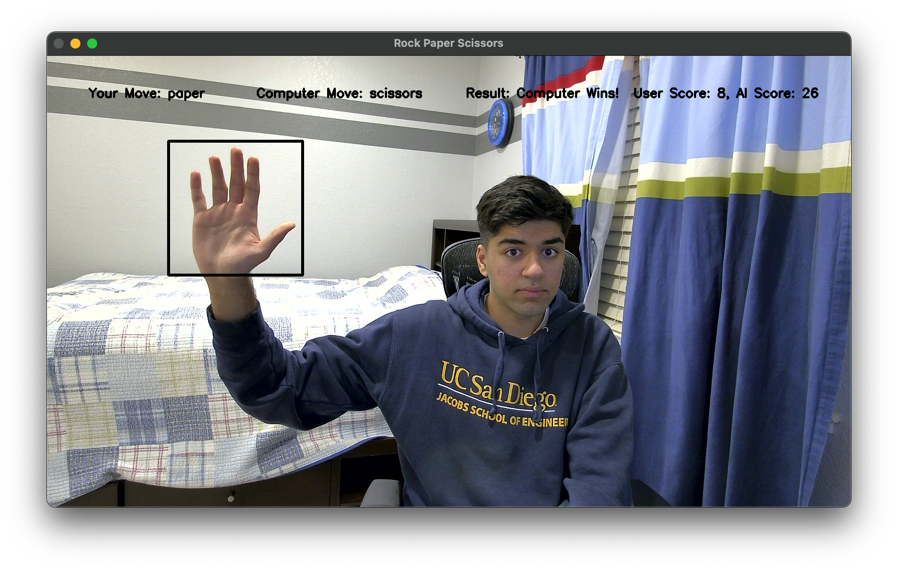

# Rock-Paper-Scissors AI

This project implements an AI-based rock-paper-scissors game by using a CNN to classify rock, paper or scissors hand gestures and an RNN to predict the user's next move to play against them.

## Screenshot

## Neural Network Accuracy and Results

The CNN can predict the hand gesture with about **99%** accuracy on the test set. 

The RNN can predict the user's move with an accuracy of **62%** on the test set. Given that rock-paper-scissors inherently has some randomness, predicting an opponent's next move with 62% accuracy is actually quite high. In fact, this is **nearly 2x better than a random baseline model** which would have an accuracy of 33.33%! 

In practice, the hand gesture prediction works nearly perfectly and the game AI is able to beat the user fairly consistently.

## Model Architecture

The CNN uses 3 convolutional and max pooling layers along with 2 fully connected layers to determine which hand gesture the user is showing.

The RNN uses 2 LSTM layers and 2 fully connected layers to predict the user's next move. The AI then plays the move that would beat the predicted move. For example, if the RNN predicts that the user would play rock, then the computer would play paper to beat the predicted move.

### CNN

- Conv2D layer
- MaxPool2d layer
- Conv2D layer
- MaxPool2d layer
- Conv2D layer
- MaxPool2d layer
- Fully Connected layer
- Dropout layer
- Fully Connected layer

### RNN

- Long short-term memory layer (2 layers)
- Fully Connected layer
- Dropout layer
- Fully Connected layer

2 LSTM layers were used to be able to handle time series data for the user's previous 6 rock paper scissors moves.

Note that the computer plays the first 6 games randomly and then uses the RNN to predict the user's move for all subsequent games.

## Data Collection

The CNN was trained by collecting 1000 images each of rock, paper and scissors hand gestures. The RNN was trained by collecting around 500 games of rock paper scissors.

## Libraries and Technologies

- PyTorch
- OpenCV
- NumPy
- Matplotlib
- tqdm

## Installation and Usage

1. Install libraries
2. Run `collect_hand_data.py` to collect images to train the CNN
3. Train the CNN by running all cells in `hand_recognition.ipynb`. Make sure to configure the PyTorch device correctly.
4. Train the RNN by running all cells in `rps_ai.ipynb`.
5. Play rock paper scissors using `game.py`.
